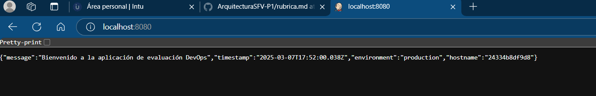

# ArquitecturaSFV-P1

# Evaluación Práctica - Ingeniería de Software V

## Información del Estudiante
- **Nombre: Juan Pablo Niño**
- **Código: A00381406**
- **Fecha: 3/7/2025**

## Resumen de la Solución
Se creó un Dockerfile con el fin de generar una imagen para el contenedor "devops-container" en este contenedor se correrá la app provista con ayuda de un script cuyo objetivo será crear dicha imagen y correr el contenedor con la app.

## Dockerfile
`FROM node:20` - Usa la imagen oficial de Node.js versión 20.

`WORKDIR /app` - Establece el directorio de trabajo dentro del contenedor.

`COPY package.json ./` - Copia solo los archivos de dependencias primero.

`RUN npm install --only=production` - Instala solo las dependencias necesarias para producción.

`COPY . .` - Copia el resto del código fuente al contenedor.

`EXPOSE 3000` - Expone el puerto en el que corre la aplicación.

`ENV NODE_ENV=production` - Define el entorno de ejecución como producción.

`CMD ["npm", "start"]` - Ejecuta la aplicación usando el script start definido en package.json.

## Script de Automatización
**Verificación de Docker**

Comprueba si Docker está instalado en el sistema. Si no está instalado, muestra un mensaje de error y termina la ejecución.

**Construcción de la Imagen**

Construye la imagen de Docker con el nombre devops-evaluation-app. Posteriormente, muestra mensajes de progreso y maneja errores si la construcción falla.

**Ejecución del Contenedor**

Verifica si ya hay un contenedor en ejecución con el mismo nombre y lo elimina si existe. Después, ejecuta un nuevo contenedor mappeando el puerto 8080 en el host con el puerto 3000 en el contenedor (-p 8080:3000). Variables de entorno (PORT=3000, NODE_ENV=production).
Modo desacoplado (-d) para que corra en segundo plano.

**Verificación del Servicio**

Espera unos segundos para que la aplicación inicie.
Usa curl para hacer una petición a http://localhost:8080/health.
Si el servicio responde correctamente con OK, muestra un mensaje de éxito.

## Principios DevOps Aplicados
1. **Automatización:**: El script Bash automatiza procesos como la construcción de la imagen, la ejecución del contenedor y pruebas automáticas con curl para verificar la salud del servicio. Esto reduce errores humanos y hace que el despliegue sea rápido y reproducible.

2. **Infraestructura como código:** Se usó un Dockerfile para definir cómo debe ejecutarse la aplicación en cualquier entorno. Esto garantiza consistencia en el despliegue sin importar de dónde se ejecute el contenedor.

3. **Desacoplamiento del entorno:** Se usó variables de entorno (PORT, NODE_ENV) en lugar de valores fijos en el código. Esto permite modificar la configuración sin necesidad de cambiar el código fuente.

## Captura de Pantalla

## Mejoras Futuras
Agregar logs más descriptivos:
Ahora mismo solo imprimes que el servidor está corriendo. Podrías agregar logs más detallados para saber en qué entorno está corriendo la app.

Definir un archivo .dockerignore:
Esto evita que archivos innecesarios se copien a la imagen de Docker y hace que la imagen sea más ligera.

Permitir configurar el puerto desde una variable de entorno en el Dockerfile
Actualmente, si alguien quiere cambiar el puerto, debe modificar el código. En su lugar, puedes hacer que el Dockerfile use un valor por defecto, pero permita cambiarlo con docker run.

## Instrucciones para Ejecutar
Al clonar este respositorio, simplemente ejecute el comando `./deploy.sh` en una consola ubicada dentro del directorio.
